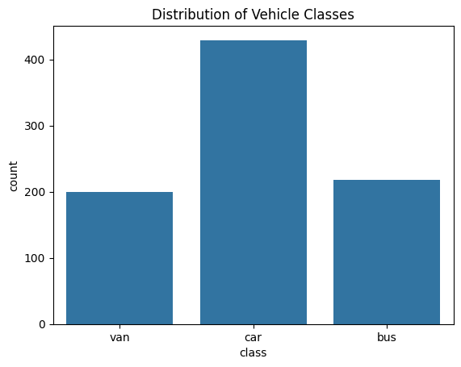
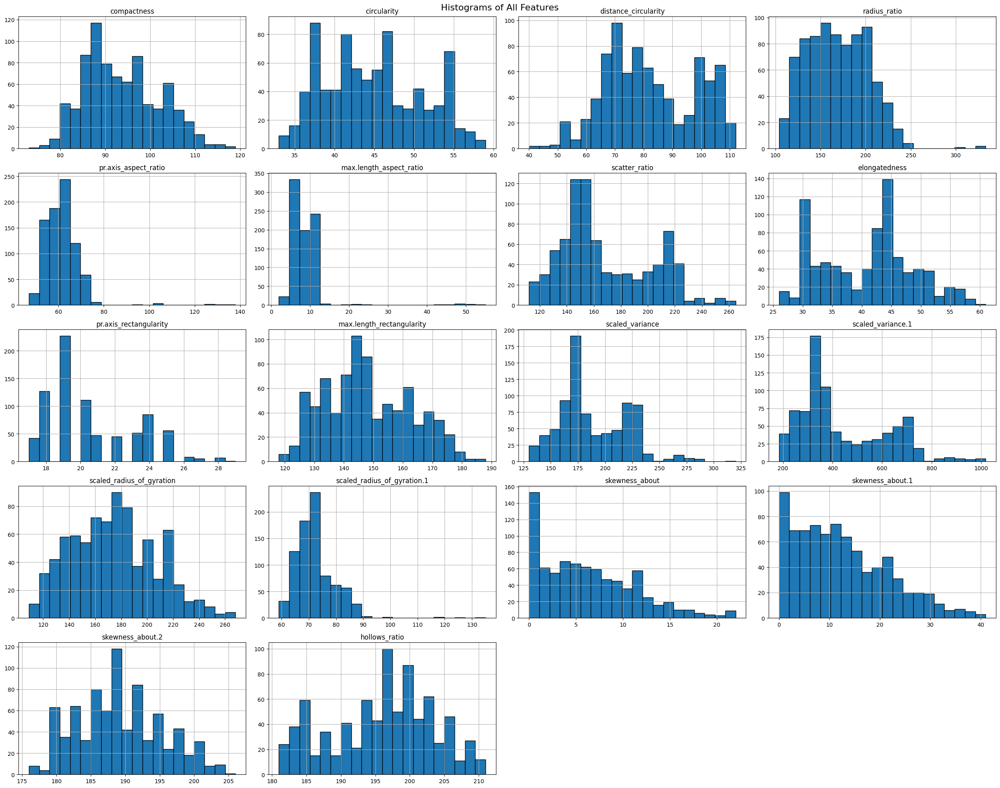
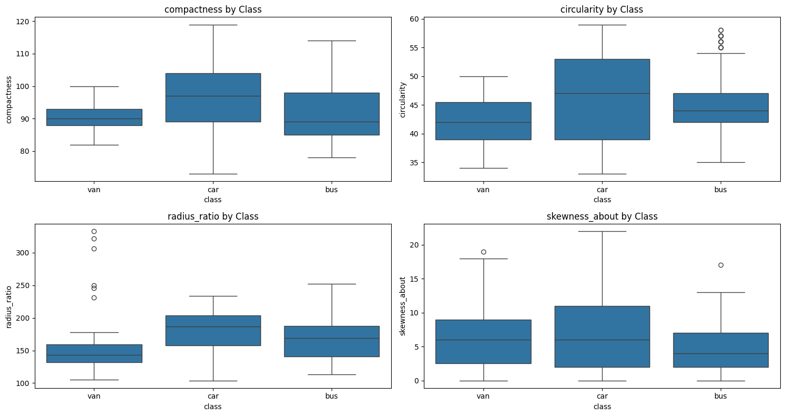
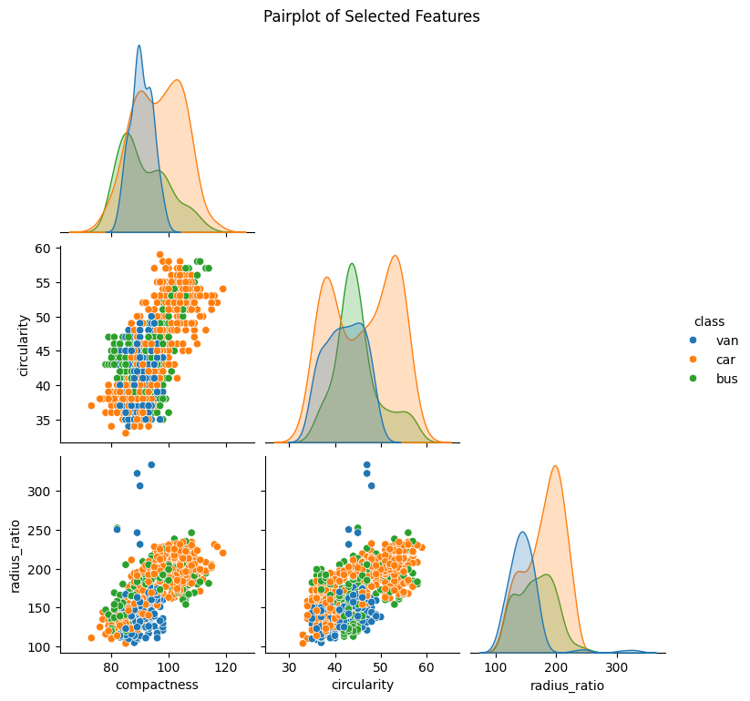

# Supervised Vehicle Classification

**Goal:** Train and evaluate supervised models to classify **buses, vans, and cars** using geometric silhouette features.  
Focus on a clear pipeline: **EDA → preprocessing → split → train → evaluate**, with reproducible steps and readable visuals.

## Key Features
- Exploratory Data Analysis of feature space and class balance
- Preprocessing (scaling/normalization; feature selection if applicable)
- Proper **train/validation** (and/or cross‑validation)
- Models with scikit‑learn (e.g., Logistic Regression, Random Forest, SVM)
- Evaluation with **accuracy, precision, recall, F1**, and **confusion matrix**
- Reproducible notebook + exported figures

## Tools & Tech
- Python: `pandas`, `numpy`, `scikit-learn`, `matplotlib`, `seaborn`
- Jupyter/Colab

## Repo Structure
```
repo/
├─ notebooks/
│  └─ vehicle_classification.ipynb
├─ outputs/
│  ├─ confusion_matrix.png
│  ├─ learning_curve.png
│  ├─ feature_importance.png
│  └─ class_distribution.png
├─ requirements.txt
└─ README.md
```

## How to Run
```bash
python -m venv .venv
# Windows: .venv\Scripts\activate
# macOS/Linux: source .venv/bin/activate
pip install -r requirements.txt
jupyter lab
# open notebooks/vehicle_classification.ipynb
```

## Example Visuals





## Notes
- Keep large/raw data out of the repo; include only tiny **SAMPLE** files if needed.
- Prefer clean, interpretable visuals and a brief narrative of key takeaways in the notebook/README.
